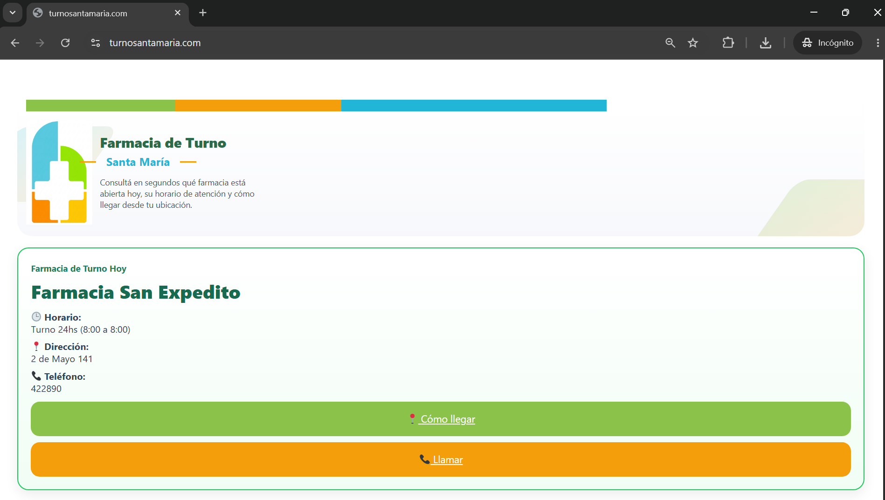
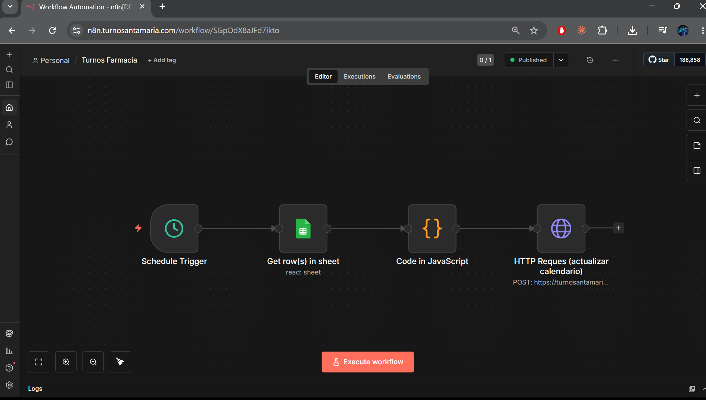

# Pharmacy Appointment Platform

Automated pharmacy appointment and reminder system built with WordPress, n8n and WhatsApp integrations.

---

## Overview

This platform was created to replace manual appointment handling through phone calls and WhatsApp messages.

The system automates:
- Appointment scheduling
- Reminder notifications
- Pharmacy duty management
- Google Sheets synchronization
- WhatsApp communication workflows

## Screenshots

### Website Interface

### Automation Workflow

---

## Features

- Automated appointment reminders
- Real-time synchronization
- WhatsApp notifications
- Google Sheets integration
- Workflow automation with n8n
- WordPress frontend
- Mobile-friendly interface

---

## Tech Stack

### Automation
- n8n
- Webhooks
- Google Sheets API

### Messaging
- WhatsApp Business API

### Web
- WordPress
- Elementor
- HTML / CSS

---

## Architecture

Patient → WhatsApp / Website → n8n Workflow → Google Sheets → Automated Reminder

---

## Results

- Reduced manual scheduling workload
- Faster communication with patients
- Centralized appointment management
- Real-world production usage

---

## Status

Production-ready project currently used in a real business environment.

---

📍 Built in Argentina
